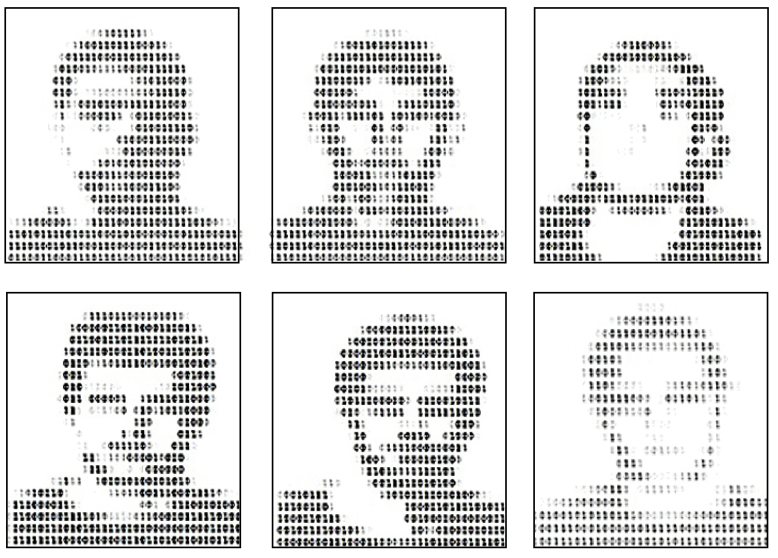

============
Introduction
============

Eyewitness identification research
----------------------------------

Eyewitnesses to crimes may try to identify the perpetrator from an identification procedure. One commonly used procedure is a lineup (identity parade in the UK). A lineup comprises the police suspect and fillers, as shown in the illustration below. A lineup with an innocent suspect is a target-absent lineup, and a lineup with a guilty suspect is a target-present lineup. The eyewitness can make a filler ID from either lineup, identify the innocent suspect or guilty suspect.

Receiver operating characteristic (ROC) analysis measures discriminability (the ability to distinguish innocent from guilty suspects), and confidence accuracy characteristic (CAC) and response-time accuracy characteristic (RAC) analysis measure positive predictive value (the likelihood the identified suspect is guilty). pyWitness allows researchers to run these analyses. 

Theories about eyewitness identification have so far been signal detection-based. pyWitness currently allows researchers to compare thses types of model fits. 

Receiver operator characteristic (ROC)
--------------------------------------

There are pacakges in R and MATLAB that smooth ROCS and calculate and statistically compare pAUCs. 

   * `pROC: an open-source package for R and S+ to analyze and compare ROC curves <https://bmcbioinformatics.biomedcentral.com/articles/10.1186/1471-2105-12-77>`_
   * `The ROC Toolbox: A MATLAB toolbox for analyzing ROCs derived from confidence ratings <https://link.springer.com/article/10.3758/s13428-016-0796-z>`_

Signal Detection Theory 
-----------------------

   * `sdtlu: an open-source package for R to run signal detection model fits on lineup data <https://link.springer.com/article/10.3758/s13428-020-01402-7>`_

Statistical tests 
-----------------

   * Uncertainties on ROCs and CACs
   * pAUC and associated statistical tests
   * Relative frequencies
   * Power analyses

Model fits 
----------

   * Independent observations
   * Integration 
   * Ensemble

Goals of pyWitness
------------------

   * Little as possible human interaction (to reduce data manipulation, transcribing values and other transformations that may create errors)
   * Place to store all relevant algorithms, fits, and methods in a reproducible and documented way
   * Bin and pivot raw data to rates (the processed data)
   * Plot and compare ROC, CAC, and RAC curves
   * Calculate pAUC and compute statistical comparisons
   * Perform statistical tests on CAC and RAC curves
   * Fit signal detection-based models to the processed data
   * Monte Carlo simulation of raw data
   * Create teaching aids to understand signal detection theory

Background to the pyWitness and the code
----------------------------------------

Our goal with pyWitness is to create a consistent set of analysis tools for any researchers to use for lineup data and other recognition memory data. Importantly, there is a flexible internal data format.

Internal data format 
^^^^^^^^^^^^^^^^^^^^

.. list-table:: Data columns and allowed values
   :widths: 35 35 35 35
   :header-rows: 1

   * - lineupSize
     - targetLineup
     - responseType
     - confidence
   * - integer 
     - "targetPresent" 
     - "suspectId"
     - integer/float
   * -
     - "targetAbsent"
     - "fillerId"
     - 
   * - 
     - 
     - "rejectId"
     - 

Minimal example data file for an experiment 

.. list-table:: Example data file
   :widths: 35 35 35 35 35
   :header-rows: 1

   * - participantId
     - lineupSize
     - targetLineup
     - responseType
     - confidence
   * - 1
     - 6
     - targetPresent
     - suspectId
     - 6
   * - 2
     - 6
     - targetAbsent
     - rejectId
     - 9
   * - 3 
     - 6
     - targetPresent
     - rejectId 
     - 1

.. note::
  Other columns can be in the data file (e.g., labels for other experimental conditions 
   or data, demographic data, or personal differenes).

Transforming data structures
^^^^^^^^^^^^^^^^^^^^^^^^^^^^

Transforming data into pyWitness format can be time consuming and error prone.

.. list-table:: Example data file transformation (sdtlu)
   :widths: 35 35 
   :header-rows: 1

   * - pyWitness  
     - sdtlu
   * - lineupSize
     - lineup_size
   * - targetLineup
     - culprit_present
   * - targetPresent
     - present
   * - targetAbsent
     - absent
   * - responseType
     - id_type
   * - suspectId
     - suspect
   * - fillerId
     - filler
   * - rejectId
     - reject
   * - confidence
     - conf_level

Data for showups
^^^^^^^^^^^^^^^^

To perform an analysis of showup data, the data need to be organised differently compared to lineup data.
rejectId for both targetAbsent and targetPresent showups need to given new confidence names. For example, if
the data are measured on a three point confidence scale (1, 2 and 3) for previously experienced ("old")items and for not previously experienced ("new") items. The subjectId for both targetPresent and
targetAbsent confidences need to be mapped to (4, 5, 6) and rejectId needs to be given (3, 2, 1).

.. note::
   Confidence can be a verbal expression and needs to be mapped to a number. For example, confidence could be low (1), 
   medium (2) or high (3).

.. note:: 
   All plots and diagrams are made using pyWitness.
