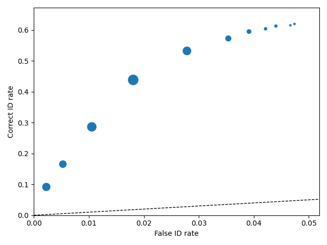
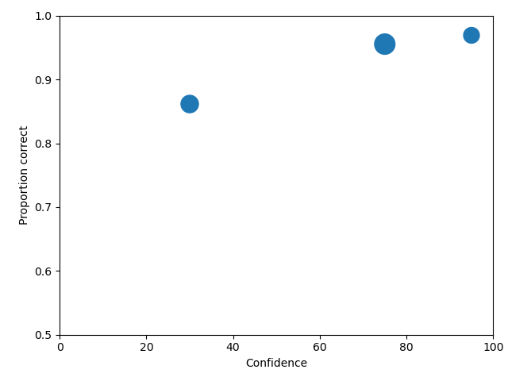
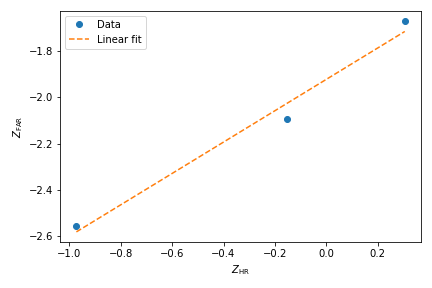
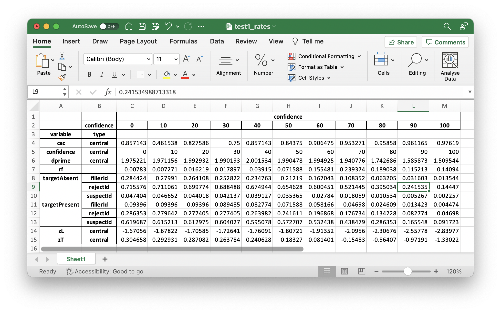

Tutorials
=========

Click on the `repository link <https://github.com/lmickes/pyWitness/releases/tag/v1.0>`_ to download the zip file, called **tutorialData.zip**, of the data you'll need to run through the tutorials. 

Make a working directory and do the tutorials in that directory. 

.. image:: http://mickeslab.com/wp-content/uploads/2022/03/tutorial1getData.gif
    :alt: getting the tutorial data

.. note::

   In the gif above, the working directory is located at Documents/demos/. The tutorial data files were placed in the directory called "demos." Whatever you call it, when working in the terminal, you'll always need to be in that directory to complete the tutorial. 

The gif also showed a few commands that you may find helpful:

   * ``pwd`` to find the directory you're currently in
   * ``cd`` to change directories
   * ``ls`` to list files in the folder

This tutorial builds up! Between each example and the previous examples, the new lines of code are highlighted in yellow. 

Python
------

Python is an interpreted object oriented programming language. There is a large range
of modules that are imported into python to provide extra functionality or features.
pyWitness uses numpy (numerical arrays), scipy (fitting and functions), pandas
(data frames), matplotlib (plotting), openpyxl (reading/writing excel),
xlrd (reading/writing excel), and numba (compiler to speed up code).

Python is best started from a terminal/command prompt

.. code-block :: console

   ipython3 --pylab

This then lands you in a python console window

.. code-block :: console

   Python 3.7.9 (default, Sep  6 2020, 16:32:30)
   Type 'copyright', 'credits' or 'license' for more information
   IPython 7.14.0 -- An enhanced Interactive Python. Type '?' for help.

   In [1]:

Commands can now be typed in to execute python and pyWitness commands. Here are some helpful tips
to speed up inputing commands 

   * Cut and paste commands (to reduce typos)
   * Use the command history (up and down cursor arrows) to find commands that were used previously
   * Use command history with search (so try ``import pyW`` and then up arrow. This will search the
     command history with that command fragment and probably match with a previous ``import pyWitness``
   * A command can be completed by using ``tab``. Try typing in ``import pyW`` and then pressing ``tab``
   * To get help on a command, type the function and then ``?`` for example, ``dp.plotROC?``

Loading raw experimental data
-----------------------------

Remember, you may need to activate pyWitness when you start a terminal by using this code

.. code-block :: python 

   conda activate pyWitness

Start up ipython3 with

.. code-block :: python 

   ipython3 --pylab

and pyWitness with

.. code-block :: python 

   import pyWitness

.. image:: http://mickeslab.com/wp-content/uploads/2022/03/tutorial1rightDirectoryStartPyWitness.gif
    :alt: getting to the right place

A single Python class `pyWitness.DataRaw <./moduledocs.html#pyWitness.DataRaw>`_ is used to load raw data in
either ``csv`` or ``excel`` format. The format of ``test1.csv`` is the same as that described in the introduction.

.. code-block :: python 

   import pyWitness
   dr = pyWitness.DataRaw("test1.csv")

Checking and exploring loaded data
----------------------------------

It is useful to understand what columns and data values are stored in the raw data.

.. code-block :: python
   :linenos:
   :emphasize-lines: 3

   import pyWitness
   dr = pyWitness.DataRaw("test1.csv")
   dr.checkData()

.. code-block :: console

   DataRaw.checkData>
   DataRaw.checkData> columns      : ['Unnamed: 0' 'participantId' 'lineupSize' 'targetLineup' 'responseType' 'confidence' 'responseTime']
   DataRaw.checkData> lineupSize   : [6]
   DataRaw.checkData> targetLineup : ['targetAbsent' 'targetPresent']
   DataRaw.checkData> responseType : ['fillerId' 'rejectId' 'suspectId']
   DataRaw.checkData> confidence   : [  0  10  20  30  40  50  60  70  80  90 100]

If the unique values for a non-mandatory column are required then this can be displayed using

.. code-block :: python
   :linenos:
   :emphasize-lines: 3

   import pyWitness
   dr = pyWitness.DataRaw("test1.csv")
   dr.columnValues("responseTime")

.. code-block :: console

   DataRaw.columnValues>           : responseTime [  1159   1296   1326 ... 161703 502420 651073]

It is possible also to load Excel files 

.. code-block :: python
   :linenos:

   import pyWitness 
   dr = pyWitness.DataRaw("test1.xlsx","test1")

The second argument is the sheet name within the workbook

Processing raw experimental data
--------------------------------
To process the raw data the function `pyWitness.DataRaw.process <./moduledocs.html#pyWitness.DataRaw.process>`_
needs to be called on a raw data object. This calculates the cumulative rates from the raw data.

.. code-block :: python 
   :linenos:
   :emphasize-lines: 3

   import pyWitness
   dr = pyWitness.DataRaw("test1.csv")
   dp = dr.process()

Once `pyWitness.DataRaw.process <./moduledocs.html#pyWitness.DataRaw.process>`_ is called two ``DataFrames`` are
created. One contains a pivot table and the other contains rates.

.. code-block :: python 
   :linenos:
   :emphasize-lines: 4-5

   import pyWitness
   dr = pyWitness.DataRaw("test1.csv")
   dp = dr.process()
   dp.printPivot()
   dp.printRates()

You should see the following output of the ``dp.printPivot()``. 

.. code-block :: console

                             confidence                                                         
   confidence                        0    10   20   30    40    50    60    70    80    90    100
   targetLineup  responseType                                                                    
   targetAbsent  fillerId            2.0  7.0  5.0  8.0  10.0  20.0  26.0  20.0  14.0   8.0   6.0
                 rejectId            2.0  5.0  5.0  6.0   9.0  24.0  35.0  56.0  68.0  43.0  64.0
   targetPresent fillerId            0.0  0.0  2.0  3.0   5.0   6.0   5.0  10.0   5.0   4.0   2.0
                 rejectId            3.0  1.0  0.0  6.0  10.0  20.0   9.0  19.0  23.0  16.0  21.0
                 suspectId           2.0  1.0  4.0  4.0  10.0  18.0  42.0  68.0  54.0  33.0  41.0
   total number of participants 890.0

In the output above are frequencies by confidence levels for each response type. To familiarize you with the output, in the table above, 11 filler identifications were given with 30% confidence on the target-absent lineups, 66 reject identifications (i.e., "The perp is not in the lineup") given with 100% confidence on the target-absent lineups, and 47 guilty suspect identifications (from target-present lineups) given with 100% confidence. 

You should also see the following output for ``dp.printRates()`` 

.. code-block :: console

                           confidence                         
                                    100        90         80         70         60         50         40         30         20         10        0  
   targetLineup  responseType                                                                                                                         
   cac           central         0.976190   0.961165   0.958580   0.953271   0.906475   0.843750   0.857143   0.750000   0.827586   0.461538  0.857143
   confidence    central         100        90         80         70         60         50         40         30         20         10        0   
   dprime        central         1.509544   1.585873   1.742686   1.940776   1.994925   1.990478   2.001534   1.990193   1.992932   1.971156  1.975221
   rf                            0.140940   0.115213   0.189038   0.239374   0.155481   0.071588   0.039150   0.017897   0.016219   0.007271  0.007830
   targetAbsent  fillerId        0.013544   0.031603   0.063205   0.108352   0.167043   0.212190   0.234763   0.252822   0.264108   0.279910  0.284424
                 rejectId        0.144470   0.241535   0.395034   0.521445   0.600451   0.654628   0.674944   0.688488   0.699774   0.711061  0.715576
                 suspectId       0.002257   0.005267   0.010534   0.018059   0.027840   0.035365   0.039127   0.042137   0.044018   0.046652  0.047404
   targetPresent fillerId        0.004474   0.013423   0.024609   0.046980   0.058166   0.071588   0.082774   0.089485   0.093960   0.093960  0.093960
                 rejectId        0.046980   0.082774   0.134228   0.176734   0.196868   0.241611   0.263982   0.277405   0.277405   0.279642  0.286353
                 suspectId       0.091723   0.165548   0.286353   0.438479   0.532438   0.572707   0.595078   0.604027   0.612975   0.615213  0.619687
   zL            central        -2.839765  -2.557781  -2.306755  -2.095603  -1.913524  -1.807208  -1.760906  -1.726409  -1.705849  -1.678225 -1.670562
   zT            central        -1.330222  -0.971908  -0.564069  -0.154827   0.081401   0.183270   0.240628   0.263784   0.287082   0.292931  0.304658                                                                                                                                

In the table above, the overall false ID rate is 0.047, the overall correct ID rate is 0.620, and the overall correct rejection rate is 0.716.

.. note::
   In the example there is no ``suspectId`` for ``targetAbsent`` lineups. Here the ``targetAbsent.suspectId`` is estimated as ``targetAbsent.fillerId/lineupSize`` 

.. image:: http://mickeslab.com/wp-content/uploads/2022/03/tutorial1rates.gif
    :alt: getting rates and pivots 

Plotting ROC curves
-------------------

.. code-block :: python 
   :linenos:
   :emphasize-lines: 4

   import pyWitness
   dr = pyWitness.DataRaw("test1.csv")
   dp = dr.process()
   dp.plotROC()

.. note:: 
   The symbol size is the relative frequency and can be changed by setting ``dp.plotROC(relativeFrequencyScale = 400)``

The black dashed line in the plot represents chance performance.

Plotting CAC curves 
-------------------

.. code-block :: python 
   :linenos:
   :emphasize-lines: 4

   import pyWitness
   dr = pyWitness.DataRaw("test1.csv")
   dp = dr.process()
   dp.plotCAC()

.. figure:: images/test1CACnoBin.png
   :alt: CAC for test1.csv

.. image:: http://mickeslab.com/wp-content/uploads/2022/03/tutorial1ROCcac.gif
   :alt: ROC and CAC plots 

Collapsing the categorical data
-------------------------------

The dataset used in this tutorial has 11 confidence levels (0, 10, 20, 30, 40, 50, 60, 70, 80, 90 and 100). Often confidence levels need to be binned or collapsed. This is best performed on the raw data before calling
``process()``. This is done with the ``collapseCategoricalData`` method of ``DataRaw``, and shown in example below, where the new bins are (0-60 map to 30, 70-80 to 75 and 90-100 to 95).

.. code-block :: python 
   :linenos:
   :emphasize-lines: 3-6
  
   import pyWitness
   dr = pyWitness.DataRaw("test1.csv")
   dr.collapseCategoricalData(column='confidence',
                              map={0: 30, 10: 30, 20: 30, 30: 30, 40: 30, 50: 30, 60: 30, 
                                   70: 75, 80: 75, 
                                   90: 95, 100: 95})
   dp = dr.process()
   dp.plotCAC()   

.. figure:: images/test1CACBin.png
   :alt: Rebinned CAC for test1.csv 

To rescale the axes, you can use

.. code-block :: python 
   :linenos:

   import matplotlib as _plt
   xlim(0,100)
   ylim(0.50,1.0)

and you get 

.. note:: 
   If you err, the ``collapseCategoricalData`` the data might be inconsistent. To start with the original data so call ``collapseCategoricalData`` with ``reload=True``

Collapsing (binning) continuous data
------------------------------------

Some data are not categorical variables, but continuous variables.

.. code-block :: python
   :linenos:
   :emphasize-lines: 3

   import pyWitness
   dr = pyWitness.DataRaw("test1.csv")
   dr.collapseContinuousData(column = "confidence",bins = [-1,60,80,100],labels= [1,2,3])
   dp = dr.process()
   dp.plotROC()

.. note::
   ``labels=None`` can be used and the bins will be automatically labelled

.. note::
   The bend edges are exclusive of the low edge and inclusive of the high edge

The ``confidence`` column is relabelled to ``confidence-original`` and ``confidence`` is filled with labels. Here is an example of the raw data
(``dr.data``) after binning.

.. code-block :: console

         Unnamed: 0  participantId  lineupSize   targetLineup responseType  confidence_original confidence  responseTime
   0              0              1           6   targetAbsent     fillerId                   60          1          8330
   1              1              2           6   targetAbsent     fillerId                   70          2         27624
   2              2              3           6  targetPresent    suspectId                   60          1          3140
   3              3              4           6   targetAbsent     rejectId                   80          2          8833
   4              4              5           6  targetPresent    suspectId                   70          2          9810
   ...          ...            ...         ...            ...          ...                  ...        ...           ...
   1041        1041           1042           6  targetPresent    suspectId                   70          2         24910
   1042        1042           1043           6  targetPresent    suspectId                   70          2         15683
   1043        1043           1044           6   targetAbsent     fillerId                   70          2          1175
   1044        1044           1045           6  targetPresent    suspectId                   70          2          2308
   1045        1045           1046           6   targetAbsent     fillerId                   90          3         18185

.. warning::
   Confidence needs to be a numerical value because ROC analysis requires a value that can be ordered.

Calculating pAUC and performing statistical tests
-------------------------------------------------

pAUC is calculated when ``dr.process()`` is called. Simpson's rule integrates the area
under the ROC curve up to a maximum value. If the maximum value is between two data points, linear interpolation is used to calculate the most liberal point (i.e., the lowest level of confidence).

.. code-block :: python
   :linenos:
   :emphasize-lines: 5

   import pyWitness
   dr = pyWitness.DataRaw("test1.csv")
   dr.collapseContinuousData(column = "confidence",bins = [-1,60,80,100],labels= [1,2,3])
   dp = dr.process()
   print(dp.pAUC)

.. figure :: images/test1_pAUC.jpg
   :alt: Data-model ROC comparision for test1.csv

Plotting RAC curves
-------------------

To plot RAC curves, in this version, v1.0, you have to relabel your "response time" column to "confidence" in your data file (e.g., csv, Excel). We recommend you copy and rename the relabeled file. This is clearly a workaround and will be fixed in the next version of pyWitness.

Once you've changed the file, you can run the code used for plotting CAC curves. We added "RAC" to make it clear that response time, not confidence, is being analysed.

.. code-block :: python 
   :linenos:

    import pyWitness
        drRAC = pyWitness.DataRaw("test1.csv")
        drRAC.collapseContinuousData(column="responseTime",
                    bins=[0, 5000, 10000, 15000, 20000, 99999],
                        labels=[1, 2, 3, 4, 5])
        dpRAC = drRAC.process(reverseConfidence=True,dependentVariable="responseTime")
        dpRAC.plotCAC()

Fitting signal detection-based models to data
---------------------------------------------

There are many models available in pyWitness. We'll start with the independent observation model. To load and process the data is the same as before (lines 1-4), the fitting
part is new and the code is highlighted (lines 5-7).

.. code-block :: python  
   :linenos: 
   :emphasize-lines: 5-7

   import pyWitness
   dr = pyWitness.DataRaw("test1.csv")
   dr.collapseContinuousData(column = "confidence",bins = [-1,60,80,100],labels= [1,2,3])
   dp = dr.process()
   mf = pyWitness.ModelFitIndependentObservation(dp)
   mf.setEqualVariance()
   mf.fit()

Line 5 constructs a fit object, line 6 sets the model parameters to equal variance and line 7 starts the minimiser. The
output from the fit (execution of line 7) is something like the following

.. code-block :: console

   fit iterations 223
   fit status     Optimization terminated successfully.
   fit time       9.376720442
   fit chi2       10.300411274463407
   fit ndf        4
   fit chi2/ndf   2.5751028186158518
   fit p-value    0.035660197825222784

.. image:: http://mickeslab.com/wp-content/uploads/2022/03/tutorial1modelFitPara.gif
    :alt: Model fit details and parameters

To clearly see how the fitting works, the following code is the same as above but
with ``mf.printParameters()`` on lines 6, 9, and 12.

.. code-block :: python
   :linenos:
   :emphasize-lines: 6,9,12

   import pyWitness
   dr = pyWitness.DataRaw("test1.csv")
   dr.collapseContinuousData(column = "confidence",bins = [-1,60,80,100],labels= [1,2,3])
   dp = dr.process()
   mf = pyWitness.ModelFitIndependentObservation(dp)
   mf.printParameters()

   mf.setEqualVariance()
   mf.printParameters()

   mf.fit()
   mf.printParameters()

After creating the ``mf`` object (line 9) the parameters are at their default values and free

.. code-block :: console

   lureMean 0.0 (free)
   lureSigma 1.0 (free)
   targetMean 1.0 (free)
   targetSigma 1.0 (free)
   lureBetweenSigma 0.0 (free)
   targetBetweenSigma 0.0 (free)
   c1 1.0 (free)
   c2 1.5 (free)
   c3 2.0 (free)

Typically you would want to control the fit parameters. ``setEqualVariance`` sets some default model which is
an appropriate start; line 12 yields

.. code-block :: console

   lureMean 0.0 (fixed)
   lureSigma 1.0 (fixed targetSigma)
   targetMean 1.0 (free)
   targetSigma 1.0 (fixed)
   lureBetweenSigma 0.3 (fixed targetBetweenSigma)
   targetBetweenSigma 0.3 (free)
   c1 1.0 (free)
   c2 1.5 (free)
   c3 2.0 (free)

Comparing these two fit parameters settings

   * ``lureSigma`` is forced to be equal to ``targetSigma``
   * ``targetSigma`` is fixed to its current value
   * ``lureBetweenSigma`` is fixed to ``targetBetweenSigma``
   * ``targetBetweenSigma`` is fixed to its current value

After running the fit the parameters are updated so the output of line 12 in the code example gives

.. code-block :: console

   ModelFit.printParameters>  lureMean 0.000 (fixed)
   ModelFit.printParameters>  lureSigma 1.000 (fixed targetSigma)
   ModelFit.printParameters>  targetMean 1.798 (free)
   ModelFit.printParameters>  targetSigma 1.000 (fixed)
   ModelFit.printParameters>  lureBetweenSigma 0.605 (fixed targetBetweenSigma)
   ModelFit.printParameters>  targetBetweenSigma 0.605 (free)
   ModelFit.printParameters>  c1 1.402 (free)
   ModelFit.printParameters>  c2 1.935 (free)
   ModelFit.printParameters>  c3 2.677 (free)

There many ways to control the model

.. list-table:: Parameter control examples
   :widths: 70 70
   :header-rows: 1

   * - Command
     - Notes
   * - ``mf.lureMean.value = -0.1``
     - Sets the lure mean parameter to -0.1
   * - ``mf.targetMean.fixed = True``
     - Fixed the parameter so it cannot change during a fit
   * - ``mf.lureMean.fixed = False``
     - Unfixes the parameter so it will be free in a fit
   * - ``mf.c1.set_equal(mf.c2)``
     - Locks ``c1`` and ``c2`` together
   * - ``mf.lureBetweenSigma.unset_equal()``
     - Release the linking of lureBetweenSigma and targetBetweenSigma

#MICKES are these command lines meant to be run?

There are multiple fits available and they all have the same interface but differ in
the construction line

.. code-block :: python
   :linenos:
   :emphasize-lines: 5-8

   dr = pyWitness.DataRaw("test1.csv")
   dr.collapseContinuousData(column="confidence")
   dp = dr.process()

   mf_io = pyWitness.ModelFitIndependentObservation(dp)
   mf_br = pyWitness.ModelFitBestRest(dp)
   mf_en = pyWitness.ModelFitEnsemble(dp)
   mf_in = pyWitness.ModelFitIntegration(dp)

Setting initial fit parameters
------------------------------

With data samples with large number of confidence bins the fits can take a large
number of iterations to converge (long run times). Sensible fit parameters can be be
estimated from the data.

To estimate the target mean :math:`\mu_t` and sigma :math:`\sigma_t` the following relation is used

.. math ::

   Z(R_{T,i}) = \frac{Z(R_{L,i})- \mu_t}{\sigma_t}

Rearranging gives

.. math ::

   \sigma_t Z(R_{T,i}) = Z(R_{L,i}) - \mu_s

There is a linear relationship between target and lure :math:`Z` values. This can be plotted
and a linear fit used to estimate the gradient and intercept.

.. code-block :: python
   :linenos:
   :emphasize-lines: 5

   import pyWitness
   dr = pyWitness.DataRaw("test1.csv")
   dr.collapseContinuousData(column = "confidence",bins = [-1,60,80,100],labels= [1,2,3])
   dp = dr.process()
   dp.plotHitVsFalseAlarmRate()

.. code-block :: python
   :linenos:
   :emphasize-lines: 9

   import pyWitness
   dr = pyWitness.DataRaw("test1.csv")
   dr.collapseContinuousData(column = "confidence",bins = [-1,60,80,100],labels= [1,2,3])
   dp = dr.process()
   mf = pyWitness.ModelFitIndependentObservation(dp)
   mf.printParameters()

   mf.setEqualVariance()
   mf.setParameterEstimates()
   mf.printParameters()

   mf.fit()
   mf.printParameters()

..
  Checking the convergence of fit
  -------------------------------
  Loading and saving fit parameters for later use
  -----------------------------------------------

Plotting fit and models
-----------------------

It is important to understand the performance of a given particular fit. The following plot compares
the experimental data to the model fit.

.. code-block :: python
   :linenos:

   import pyWitness
   dr = pyWitness.DataRaw("test1.csv")
   dr.collapseContinuousData(column = "confidence",bins = [-1,60,80,100],labels= None)
   dp = dr.process()
   dp.calculateConfidenceBootstrap(nBootstraps=200)
   mf = pyWitness.ModelFitIndependentObservation(dp)
   mf.setEqualVariance()
   mf.fit()

To compare an *ROC* plot between data and fit

.. code-block :: python

   dp.plotROC(label="Data")
   mf.plotROC(label="Indep. obs. fit")

   import matplotlib.pyplot as _plt
   _plt.legend()

.. figure:: images/test1ROCcomparisonBin.png
   :alt: Data-model ROC comparision for test1.csv

.. image:: http://mickeslab.com/wp-content/uploads/2022/03/tutorial1fitDataROCplot.gif
    :alt: ROC data and model fit plotted

To compare a *CAC* plot between data and fit

.. code-block :: python

   dp.plotCAC(label="Data")
   mf.plotCAC(label="Indep. obs. fit")

   import matplotlib.pyplot as _plt
   _plt.legend()

.. figure:: images/test1CACcomparisonBin.png
   :alt: Data-model CAC comparision for test1.csv

To compare frequencies in each bin between data and fit

.. code-block :: python

   mf.plotFit()

.. figure:: images/testPlotFit.png
   :alt: Data-model comparision for test1.csv

Once a fit has been performed, the model can be displayed as a function of memory strength and includes the lure and target distributions with means and standard deviations (top panel of plot below) and the associated criteria, c1 (low confidence), c2 (medium confidence), and c3 (high confidence) (bottom panel of plot below). This simple command belonging to a ModelFit object can be used to make the plot below.

.. code-block :: python

   mf.plotModel()

.. figure:: images/testPlotModel.png
   :alt: Independent Observation model fit

d-prime calculation
-------------------

The d-prime can be calculated by computing

.. math ::

   d^{\prime} = Z(R_{T,i}) - Z(R_{L,i})

where :math:`R_{T,i}` is the cumulative rate for targets (:math:`T`) with confidence :math:`i`, :math:`R_{L,i}` is the cumulative
rate for lures (:math:`L`) with confidence :math:`i` and :math:`Z` is the inverse normal CDF. This can be evaluated for every
confidence bin, but there are conventions for lineups and showups. For all confidence levels :math:`d^{\prime}` is stored in the rates
dataframe, so ``dp.printRates()`` gives

.. code-block :: console
   :linenos:
   :emphasize-lines: 6

                              confidence
   confidence                          3          2          1
   targetLineup  responseType
   cac           central        0.956357   0.940618   0.839228
   confidence    central       95.588235  74.859335  44.778068
   dprime        central        1.433207   1.748223   1.767339
   rf                           0.264691   0.422903   0.312406
   targetAbsent  fillerId       0.044660   0.141748   0.335922
                 rejectId       0.217476   0.473786   0.664078
                 suspectId      0.007443   0.023625   0.055987
   targetPresent fillerId       0.018832   0.080979   0.152542
                 rejectId       0.080979   0.163842   0.276836
                 suspectId      0.158192   0.406780   0.570621

A member variable ``dPrime`` in ``DataProcessed`` is set according to
   * Lineup convention :math:`d^{\prime}` is the lowest confidence (most liberal) so ``dp.dPrime`` is ``1.767339``
   * Showup convention :math:`d^{\prime}` is the lowest positive confidence

:math:`d` can also be calculated from a signal detection model so

.. math ::

   d = \frac{\mu_{T} - \mu_{L}}{ \sqrt{\frac{\sigma_T^2 + \sigma_L^2}{2}} }

This is calculated from the fit parameters for the fits described in the previous section so

.. code-block :: console

   In [X]: mf.d
   Out[X]: 1.6671878567242588

Writing results to file 
-----------------------

The internal dataframes can be written to either ``csv`` or ``xlsx`` file format for further analysis. There are four functions belonging to ``DataProcessed``.

   * ``writePivotExcel`` writes the pivot table to excel
   * ``writePivotCsv`` writes the pivot table to csv
   * ``writeRatesExcel`` writes the cummulative rates table to excel
   * ``writeRatesCsv`` writes the cummulative rates table to csv

The string argument for the functions is the file name. 

.. code-block :: python 
   :linenos:
   :emphasize-lines: 4-7
   
   import pyWitness
   dr = pyWitness.DataRaw("test1.csv")
   dp = dr.process()  
   dp.writePivotExcel("test1_pivot.xlsx")
   dp.writePivotCsv("test1_pivot.csv")
   dp.writeRatesExcel("test1_rates.xlsx")
   dp.writeRatesCsv("test1_rates.csv")

.. figure:: images/test1PivotExcel.png

