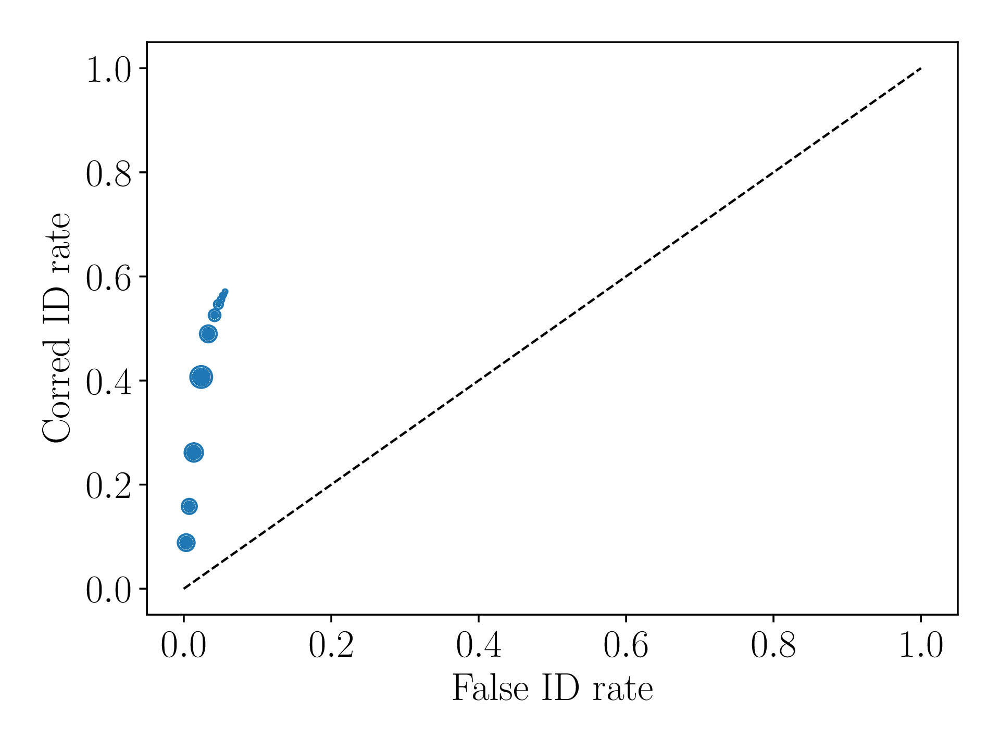
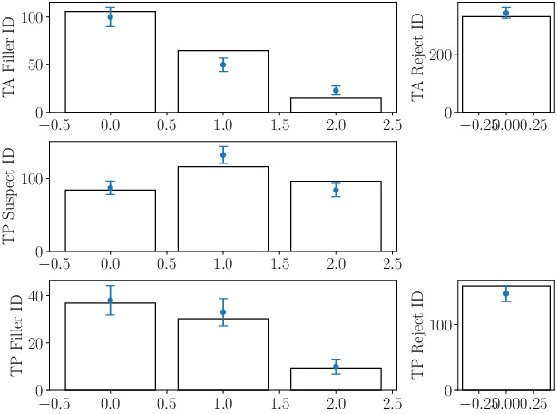
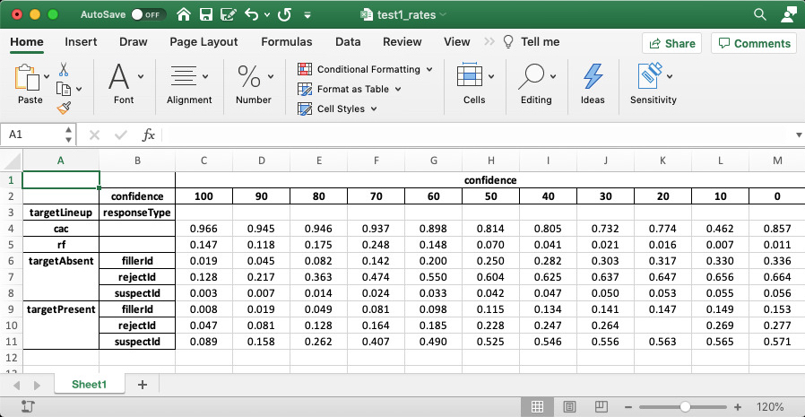

Tutorials
=========

.. warning::
   The data files used in this tutorial are stored in ``pyWitness/data/tutorial/``. It is a good idea to copy these files to your working 
   directory change directoy ``cd`` to that directory. This tutorial builds up! Between each example and previous examples the new lines of 
   code are highlighted in yellow.

.. warning::
   Calculating pAUC statistical tests,

Python
------

Python is a interpreted object oriented programming language. There is a large range
of modules which python imported into python to provide extra functionality or features.
pyWitness uses numpy (numerical arrays), scipy (fitting and functions), pandas
(data frames), matplotlib (plotting), openpyxl (reading/writing excel),
xlrd (reading/writing excel) and numba (compiler to speed up code).

Python is best started from a terminal/command prompt

.. code-block :: console

   ipython3 --pylab

This then lands you in a python console window

.. code-block :: console

   Python 3.7.9 (default, Sep  6 2020, 16:32:30)
   Type 'copyright', 'credits' or 'license' for more information
   IPython 7.14.0 -- An enhanced Interactive Python. Type '?' for help.

   In [1]:

Now commands can be typed in to execute python and pyWitness commands. There are some key tips
which can speed up inputing commands into python

   * Always try and cut and paste commands from the manual (this will reduce typos)
   * Use the command history (up and down cursor arrows) to find commands that were used previously
   * Use command history with search (so try ``import pyW`` and then up arrow. This will search the
     command history with that command fragment and probably match with a previous ``import pyWitness``
   * A command can be completed by using ``tab``. So try typing in ``import pyW`` and then hitting ``tab``

Loading raw experimental data
-----------------------------

A single Python class `pyWitness.DataRaw <./moduledocs.html#pyWitness.DataRaw>`_ is used to load raw data in
either ``csv`` or ``excel`` format. The format of ``test1.csv`` is the same as that described in the introduction.

.. code-block :: python 

   import pyWitness
   dr = pyWitness.DataRaw("test1.csv")

Processing raw experimental data
--------------------------------
To process the raw data the function `pyWitness.DataRaw.process <./moduledocs.html#pyWitness.DataRaw.process>`_
needs to be called on a raw data object. The calculates the cumulative rates from the raw data.

.. code-block :: python 
   :linenos:
   :emphasize-lines: 3

   import pyWitness
   dr = pyWitness.DataRaw("test1.csv")
   dp = dr.process()

Once `pyWitness.DataRaw.process <./moduledocs.html#pyWitness.DataRaw.process>`_ is called two ``DataFrames`` are
created one which contains a pivot table and another that contains rates

.. code-block :: python 
   :linenos:
   :emphasize-lines: 4-5

   import pyWitness
   dr = pyWitness.DataRaw("test1.csv")
   dp = dr.process()
   dp.printPivot()
   dp.printRates()

You should see  the output of the ``dp.printPivot()``

.. code-block :: console

                              confidence                                                          
   confidence                        0    10   20    30    40    50    60    70    80    90    100
   targetLineup  responseType                                                                     
   targetAbsent  fillerId            3.0  7.0  7.0  11.0  16.0  26.0  30.0  31.0  19.0  13.0  10.0
                 rejectId            4.0  5.0  5.0   6.0  11.0  28.0  39.0  57.0  75.0  46.0  66.0
   targetPresent fillerId            2.0  1.0  3.0   4.0  10.0   9.0   9.0  17.0  16.0   6.0   4.0
                 rejectId            4.0  3.0  NaN   9.0  10.0  23.0  11.0  19.0  25.0  18.0  25.0
                 suspectId           3.0  1.0  4.0   5.0  11.0  19.0  44.0  77.0  55.0  37.0  47.0

And you should see the following for ``dp.printRates()``

.. code-block :: console

                              confidence                                                                                                    
   confidence                        100       90        80        70        60        50        40        30        20        10        0  
   targetLineup  responseType                                                                                                               
   cac                          0.965753  0.944681  0.945559  0.937120  0.897959  0.814286  0.804878  0.731707  0.774194  0.461538  0.857143 
   rf                           0.146660  0.118031  0.175289  0.247614  0.147664  0.070316  0.041185  0.020593  0.015570  0.006529  0.010547
   targetAbsent  fillerId       0.019417  0.044660  0.081553  0.141748  0.200000  0.250485  0.281553  0.302913  0.316505  0.330097  0.335922
                 rejectId       0.128155  0.217476  0.363107  0.473786  0.549515  0.603883  0.625243  0.636893  0.646602  0.656311  0.664078
                 suspectId      0.003236  0.007443  0.013592  0.023625  0.033333  0.041748  0.046926  0.050485  0.052751  0.055016  0.055987
   targetPresent fillerId       0.007533  0.018832  0.048964  0.080979  0.097928  0.114878  0.133710  0.141243  0.146893  0.148776  0.152542
                 rejectId       0.047081  0.080979  0.128060  0.163842  0.184557  0.227872  0.246704  0.263653       NaN  0.269303  0.276836
                 suspectId      0.088512  0.158192  0.261770  0.406780  0.489642  0.525424  0.546139  0.555556  0.563089  0.564972  0.570621

.. note::
   In the example there is no ``suspectId`` for ``targetAbsent`` lineups. Here the ``targetAbsent.suspectId`` is estimated as ``targetAbsent.fillerId/lineupSize`` 

Plotting ROC curves
-------------------

.. code-block :: python 
   :linenos:
   :emphasize-lines: 4

   import pyWitness
   dr = pyWitness.DataRaw("test1.csv")
   dp = dr.process()
   dp.plotROC()

.. note:: 
   The symbol size is the relative frequency and can be changed by setting ``dp.plotROC(relativeFrequencyScale = 400)``

Plotting CAC curves 
-------------------

.. code-block :: python 
   :linenos:
   :emphasize-lines: 4

   import pyWitness
   dr = pyWitness.DataRaw("test1.csv")
   dp = dr.process()
   dp.plotCAC()

.. figure:: images/test1_cac.jpg
   :alt: CAC for test1.csv

Plotting RAC curves
-------------------

Collapsing the catagorical data
-------------------------------

The example in this tutorial as 11 confidence levels (0, 10, 20, 30, 40, 50, 60, 70, 80, 90 and 100). Typically
categorical confidence levels need to be binned or collapsed. This is best performed on the raw data before calling
``process()``. This is done with the ``collapseCategoricalData`` method of ``DataRaw``. This is shown in example below,
where the new bins are (0-60 map to 30, 70-80 to 75 and 90-100 to 95).

.. code-block :: python 
   :linenos:
   :emphasize-lines: 3-6
  
   import pyWitness
   dr = pyWitness.DataRaw("test1.csv")
   dr.collapseCategoricalData(column='confidence',
                              map={0: 30, 10: 30, 20: 30, 30: 30, 40: 30, 50: 30, 60: 30, 
                                   70: 75, 80: 75, 
                                   90: 95, 100: 95})
   dp = dr.process()
   dp.plotCAC()   

.. figure:: images/test1_rebinned.jpg
   :alt: Rebinned CAC for test1.csv 

.. note:: 
   If you mess up the ``collapseCategoricalData`` the data might be inconsistent. To start with the original data so
   call ``collapseCategoricalData`` with ``reload=True``

Collapsing (binning) continuous data
------------------------------------

Some data are not catagories for but a continuous variable.

.. code-block :: python
   :linenos:
   :emphasize-lines: 3

   import pyWitness
   dr = pyWitness.DataRaw("test1.csv")
   dr.collapseContinuousData(column = "confidence",bins = [-1,60,80,100],labels= [1,2,3])
   dp = dr.process()
   dp.plotROC()

The ``confidence`` column is relabelled to ``confidence-original`` and ``confidence`` is filled with labels. The mean and
standard deviation is computed and filled in ``confidence-mean`` and ``confidence-std``. Here is an example of the raw data
(``dr.data``) after binning.

.. code-block :: console

         Unnamed: 0  participantId  lineupSize   targetLineup responseType  confidence_original confidence  responseTime
   0              0              1           6   targetAbsent     fillerId                   60          1          8330
   1              1              2           6   targetAbsent     fillerId                   70          2         27624
   2              2              3           6  targetPresent    suspectId                   60          1          3140
   3              3              4           6   targetAbsent     rejectId                   80          2          8833
   4              4              5           6  targetPresent    suspectId                   70          2          9810
   ...          ...            ...         ...            ...          ...                  ...        ...           ...
   1041        1041           1042           6  targetPresent    suspectId                   70          2         24910
   1042        1042           1043           6  targetPresent    suspectId                   70          2         15683
   1043        1043           1044           6   targetAbsent     fillerId                   70          2          1175
   1044        1044           1045           6  targetPresent    suspectId                   70          2          2308
   1045        1045           1046           6   targetAbsent     fillerId                   90          3         18185

.. warning::
   The confidence needs to be a numerical value as ROC analysis requires a value which can be ordered.

Calculating pAUC and performing statistical tests
-------------------------------------------------

Partial area under the curve is calculated when ``dr.process()`` is called. Simpsons rule is integrate the area
under the ROC upto a maximum value. If the maximum value is between two data points linear interpolation is used
to calculate the most liberal point.

.. code-block :: python
   :linenos:
   :emphasize-lines: 5

   import pyWitness
   dr = pyWitness.DataRaw("test1.csv")
   dr.collapseContinuousData(column = "confidence",bins = [-1,60,80,100],labels= [1,2,3])
   dp = dr.process()
   print(dp.pAUC)

Fitting signal detection models to data
---------------------------------------

There are many models available in pyWitness. We'll start with the independent observation model. To load and process
the data is the same as before

.. code-block :: python  
   :linenos: 
   :emphasize-lines: 5-7

   import pyWitness
   dr = pyWitness.DataRaw("test1.csv")
   dr.collapseContinuousData(column = "confidence",bins = [-1,60,80,100],labels= [1,2,3])
   dp = dr.process()
   mf = pyWitness.ModelFitIndependentObservation(dp)
   mf.setEqualVariance()
   mf.fit()

Line 9 sets the parameters for the fit. To display the fit parameters there is a function printParameters so

.. code-block :: python
   :linenos:
   :emphasize-lines: 6,9,12

   import pyWitness
   dr = pyWitness.DataRaw("test1.csv")
   dr.collapseContinuousData(column = "confidence",bins = [-1,60,80,100],labels= [1,2,3])
   dp = dr.process()
   mf = pyWitness.ModelFitIndependentObservation(dp)
   mf.printParameters()

   mf.setEqualVariance()
   mf.printParameters()

   mf.fit()
   mf.printParameters()

After creating the ``mf`` object (line 9) the parameters are at their default values and free

.. code-block :: console

   lureMean 0.0 (free)
   lureSigma 1.0 (free)
   targetMean 1.0 (free)
   targetSigma 1.0 (free)
   lureBetweenSigma 0.0 (free)
   targetBetweenSigma 0.0 (free)
   c1 1.0 (free)
   c2 1.5 (free)
   c3 2.0 (free)

Typically you would want to control the fit parameters. ``setEqualVariance`` sets some default model which is
an appropriate start so line 12 yields

.. code-block :: console

   lureMean 0.0 (fixed)
   lureSigma 1.0 (fixed targetSigma)
   targetMean 1.0 (free)
   targetSigma 1.0 (fixed)
   lureBetweenSigma 0.3 (fixed targetBetweenSigma)
   targetBetweenSigma 0.3 (free)
   c1 1.0 (free)
   c2 1.5 (free)
   c3 2.0 (free)

Comparing these two fit parameters settings

   * ``lureSigma`` is forced to be equal to ``targetSigma``
   * ``targetSigma`` is fixed to its current value
   * ``lureBetweenSigma`` is fixed to ``targetBetweenSigma``
   * ``targetBetweenSigma`` is fixed to its current value

After running the fit the parameters are updated so the output of line 15 in the code example gives

.. code-block :: console

   lureMean 0.0 (fixed)
   lureSigma 1.0 (fixed targetSigma)
   targetMean 1.6644667559751338 (free)
   targetSigma 1.0 (fixed)
   lureBetweenSigma 0.47633248791026106 (fixed targetBetweenSigma)
   targetBetweenSigma 0.47633248791026106 (free)
   c1 1.3610178212548698 (free)
   c2 1.8627517728791307 (free)
   c3 2.5659741783090464 (free)

There lots of ways to control the model

.. list-table:: Parameter control examples
   :widths: 70 70
   :header-rows: 1

   * - Command
     - Notes
   * - ``mf.lureMean.value = -0.1``
     - Sets the lure mean parameter to -0.1
   * - ``mf.targetMean.fixed = True``
     - Fixed the parameter so it cannot change during a fit
   * - ``mf.lureMean.fixed = False``
     - Unfixes the parameter so it will be free in a fit
   * - ``mf.c1.set_equal(mf.c2)``
     - Locks ``c1`` and ``c2`` together
   * - ``mf.lureBetweenSigma.unset_equal()``
     - Release the linking of lureBetweenSigma and targetBetweenSigma

There are multiple fits available and they all have the same interface they differ in the construction line

.. code-block :: python
   :linenos:
   :emphasize-lines: 5-8

   dr = pyWitness.DataRaw("test1.csv")
   dr.collapseContinuousData(column="confidence")
   dp = dr.process()

   mf_io = pyWitness.ModelFitIndependentObservation(dp)
   mf_br = pyWitness.ModelFitBestRest(dp)
   mf_en = pyWitness.ModelFitEnsemble(dp)
   mf_in = pyWitness.ModelFitIntegration(dp)

Plotting fit and models
-----------------------

It is important to understand the performance of a given particular fit. The following plot compares
the experimental data to the model fit.

.. code-block :: python
   :linenos:
   :emphasize-lines: 8

   import pyWitness
   dr = pyWitness.DataRaw("test1.csv")
   dr.collapseContinuousData(column = "confidence",bins = [-1,60,80,100],labels= [1,2,3])
   dp = dr.process()
   mf = pyWitness.ModelFitIndependentObservation(dp)
   mf.setEqualVariance()
   mf.fit()
   mf.plotFit()

Writing results to file 
-----------------------

The internal dataframes can be written to either ``csv`` or ``xlsx`` file format for further analysis. There are four
functions belonging to ``DataProcessed``.

   * ``writePivotExcel`` writes the pivot table to excel
   * ``writePivotCsv`` writes the pivot table to csv
   * ``writeRatesExcel`` writes the cummulative rates table to excel
   * ``writeRatesCsv`` writes the cummulative rates table to csv

The string argument for the functions is the file name. 

.. code-block :: python 
   :linenos:
   :emphasize-lines: 4-7
   
   import pyWitness
   dr = pyWitness.DataRaw("test1.csv")
   dp = dr.process()  
   dp.writePivotExcel("test1_pivot.xlsx")
   dp.writePivotCsv("test1_pivot.csv")
   dp.writeRatesExcel("test1_rates.xlsx")
   dp.writeRatesCsv("test1_rates.csv")

.. figure:: images/test1_pivot_excel.jpg

