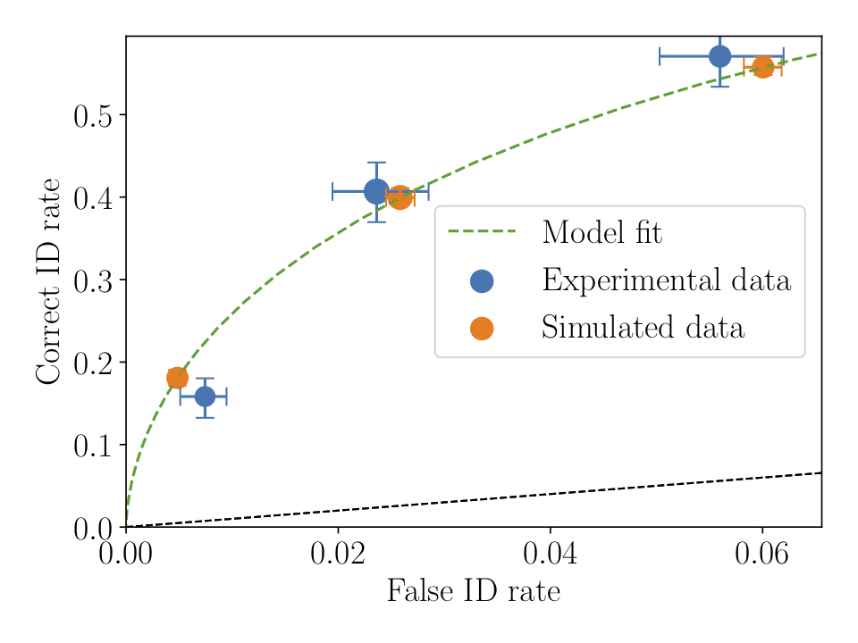

Advanced tutorials
==================

Bootstrapping uncertainties/confidence limits
---------------------------------------------

To create confidence limits on binned cumulative, statistical measures and parameters, pyWitness uses
the bootstrap method. This method takes N random participants from the original data *with replacement*.
pyWitness can then proceed to compute any quantity (ROC, CAC, pAUC, fit parameters). This is repeated M
times and the distribution of the computed quantity used to calculate a confidence interval with a user
definable range.

.. code-block :: python
   :linenos:

   import pyWitness
   dr = pyWitness.DataRaw("test1.csv")
   dp = dr.process()
   dp.calculateConfidenceBootstrap(nBootstraps=200, cl=95)

After calling ``calculateConfidenceBootstrap`` the rates table is populated with the 95% confidence limit
data

.. code-block :: console

                                confidence
   confidence                            3         2         1
   targetLineup  responseType
   cac           central          0.956357  0.940618  0.839228
                 high             0.972634  0.954553  0.872744
                 low              0.941128  0.924256  0.804342
   rf                             0.264691  0.422903  0.312406
   targetAbsent  fillerId         0.044660  0.141748  0.335922
                 fillerId_high    0.061102  0.165681  0.364264
                 fillerId_low     0.030039  0.119101  0.300467
                 rejectId         0.217476  0.473786  0.664078
                 rejectId_high    0.246578  0.514653  0.699533
                 rejectId_low     0.191284  0.442407  0.635736
                 suspectId        0.007443  0.023625  0.055987
                 suspectId_high   0.010184  0.027614  0.060711
                 suspectId_low    0.005006  0.019850  0.050078
   targetPresent fillerId         0.018832  0.080979  0.152542
                 fillerId_high    0.030098  0.100959  0.178660
                 fillerId_low     0.009258  0.062043  0.125396
                 rejectId         0.080979  0.163842  0.276836
                 rejectId_high    0.099837  0.190588  0.313290
                 rejectId_low     0.062990  0.140654  0.247567
                 suspectId        0.158192  0.406780  0.570621
                 suspectId_high   0.182503  0.444297  0.605620
                 suspectId_low    0.135651  0.371787  0.534313

If a plot function (``plotROC``, ``plotCAC``) is callled after calling ``calculateConfidenceBootstrap`` then
the confidence interval is drawn as error bars.

Loading raw data excel format
-----------------------------

If the file is in ``excel`` format you will need to specify which sheet the raw data is stored in 

.. code-block :: python 
   :linenos:

   import pyWitness
   dr = pyWitness.DataRaw("test2.xlsx",excelSheet = "raw data")

Transforming data into common format
------------------------------------

The raw experimental data does not have to be in the internal format used by pyWitness. As the data is loaded is it
possible to replace the name of the data columns and the values stored.

.. code-block :: python 

   import pyWitness
   dr = pyWitness.DataRaw("test2.csv", dataMapping = {"lineupSize":"lineup_size",
                                                     "targetLineup":"culprit_present",
						     "targetPresent":"present",
						     "targetAbsent":"absent",
						     "responseType":"id_type",
						     "suspectId":"suspect",
						     "fillerId":"filler",
						     "rejectId":"reject",
						     "confidence":"conf_level"}))

Processing data for a single condition
--------------------------------------

A single data file might have multiple different experimental condtions. Imagine your data file 
has a column labelled ``Condition`` and the values for each participant is either ``Sequential`` or 
``Simultaneous``. To proccess only the ``Sequential`` participants the following options are required
for DataRaw.process() 

.. code-block :: python
   :linenos:
   :emphasize-lines: 3

   import pyWitness
   dr = pyWitness.DataRaw("test1.csv")
   dp = dr.process("Condition","Sequential")   

So if you had a file with multiple conditions it would be straightforward to make multiple 
``DataProcessed`` for each condition, as in the following 

.. code-block :: python
   :linenos:
   :emphasize-lines: 3-4

   import pyWitness
   dr = pyWitness.DataRaw("test1.csv")
   dpSeq = dr.process("Condition","Sequential")   
   dpSim = dr.process("Condition","Simultaneous")   

Loading processed data 
----------------------

You might already have processed the raw data. It is possible to load a file to perform model fits etc. The processed
data needs to be in the following CSV format. This is basically the same format as the pivot table stored in ``DataProcessed``.

.. list-table:: Processed data columns and allowed values
   :widths: 35 15 15 15 15 15 15 15 15 15 15 15 
   :header-rows: 0

   * - confidence 
     - 0 
     - 10
     - 20
     - 30
     - 40
     - 50 
     - 60
     - 70
     - 80 
     - 90
     - 100
   * - targetAbsent fillerId 
     - 3
     - 7
     - 7
     - 11
     - 16
     - 26
     - 30
     - 31
     - 19
     - 13
     - 10
   * - targetAbsent rejectId
     - 4
     - 5
     - 5
     - 6
     - 11
     - 28
     - 39
     - 57
     - 75
     - 46
     - 66
   * - targetPresent fillerId
     - 2
     - 1
     - 3
     - 4
     - 10
     - 9
     - 9
     - 17
     - 16
     - 6
     - 4
   * - targetPresent rejectId 
     - 4
     - 3
     - 
     - 9
     - 10
     - 23
     - 11
     - 19
     - 25
     - 18
     - 25
   * - targetPresent suspectId
     - 3
     - 1
     - 4 
     - 5
     - 11 
     - 19
     - 44
     - 77
     - 55
     - 37
     - 47

.. note :: 
   If the ``targetAbsent suspectId`` row is not present it is estimated by ``(targetAbsent fillerId)/lineupSize``

This data is stored in ``data/tutorials/test1_processed.csv``

.. code-block :: python
   :linenos:
   :emphasize-lines: 2

   import pyWitness
   dp = pyWitness.DataProcessed("test1_processed.csv", lineupSize = 6)
   
Using instances of raw data, processed data and model fits
----------------------------------------------------------

Using an object orientated approach allows multiple instances (objects) to be created and manipulated. This allows many
different data file variations on the processed data and model fits to be manipulated simultanuously in a single
Python session.

A good example is collapsing data, one might want to check the effect of rebinning the data. In the following example,
the ``test1.csv`` is processed twice, once with the original binning (``dr1`` and ``dp1``) and one with 3 confidence bins
(``dr2`` and ``dp2``)

.. code-block :: python

   import pyWitness
   dr1 = pyWitness.DataRaw("test1.csv")
   dr2 = pyWitness.DataRaw("test1.csv")
   
   dr2.collapseContinuousData(column = "confidence",bins = [-1,60,80,100],labels=None)

   dp1 = dr1.process()
   dp2 = dr2.process()

   dp1.plotCAC()   
   dp2.plotCAC()

Overlaying plots
----------------

In general, each ``plotXXX`` function does not create a canvas, so to overlay plots the functions need to be called
sequentially in order.

To make a legend the plots need to be given a label. So this example is the same as the 

.. code-block :: python
   :linenos:
   :emphasize-lines: 10-14

   import pyWitness
   dr1 = pyWitness.DataRaw("test1.csv")
   dr2 = pyWitness.DataRaw("test1.csv")
   
   dr2.collapseContinuousData(column = "confidence",bins = [-1,60,80,100],labels=None)

   dp1 = dr1.process()
   dp2 = dr2.process()

   dp1.plotCAC(label = "11 bins")   
   dp2.plotCAC(label = "3 bins")
   
   import matplotlib.pyplot as _plt
   _plt.legend()

.. figure:: images/test1_overlay.jpg
   :alt: CAC for test1.csv with two different binning

After overlaying plots it maybe important to change the plot axis ranges this can be done with ``xlim`` and ``ylim``

.. code-block :: python

   xlim(0,1)
   ylim(0,1)

Generating data from signal detection model
-------------------------------------------

Raw and processed data can be generated simply from a signal detection model.

.. code-block :: python
   :linenos:
   :emphasize-lines: 8

   import pyWitness
   dr = pyWitness.DataRaw("test1.csv")
   dr.collapseContinuousData(column = "confidence",bins = [-1,60,80,100],labels=None)
   dp = dr.process()
   mf = pyWitness.ModelFitIndependentObservation(dp)
   mf.setEqualVariance()
   mf.fit()
   dr1 = mf.generateRawData(nGenParticipants=10000)

``dr1`` is a ``DataRaw`` object and is simulated data for 10,000 participants. ``dr1`` can be used for any
pyWitness analysis so ROC, CAC, pAUC, etc. The raw data can also be written to disk to either preserve and/or
share with colleagues.

.. code-block :: python
   :linenos:
   :emphasize-lines: 1-2

   dr1.writeCsv()
   dr1.writeExcel()

So having performed a fit on ``dr`` and generated ``dr1`` a synthetic dataset

.. code-block :: python
   :linenos:

   # Need to process the synthetic data
   dp1 = dr1.process()

   # calculate uncertainties using bootstrap
   dp.calculateConfidenceBootstrap()
   dp1.calculateConfidenceBootstrap()

   # plot ROCs
   dp.plotROC(label="Experimental data")
   dp1.plotROC(label="Simulated data")
   mf.plotROC(label="Model fit")

   import matplotlib.pyplot as _plt
   _plt.legend()

Power analysis
--------------

By having the ability to generate data from a model it is possible to vary the number of generated participants.
This is not too dissimilar to bootstrapping. Instead of generating new samples (with replacement) from the
data, new samples with variable numbers of participants is possible. For each sample all the analysis can be
performed and dependence on sample size can be explored.
