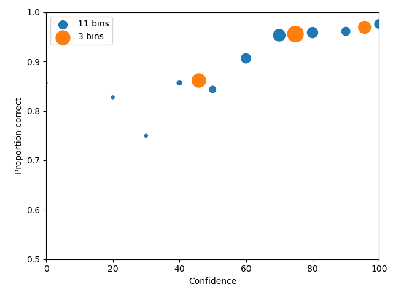

Advanced tutorials
==================

Bootstrapping uncertainties/confidence limits
---------------------------------------------

To create confidence limits on binned cumulative, statistical measures and parameters, pyWitness uses
the bootstrap method. This method takes :math:`N` random participants from the original data *with replacement*.
pyWitness can then proceed to compute any quantity (ROC, CAC, pAUC, fit parameters). This is repeated :math:`M`
times and the distribution of the computed quantity used to calculate a confidence interval with a user
definable range.

.. code-block :: python
   :linenos:

   import pyWitness
   dr = pyWitness.DataRaw("test1.csv")
   dp = dr.process()
   dp.calculateConfidenceBootstrap(nBootstraps=200, cl=95)

After calling ``calculateConfidenceBootstrap`` the rates table is populated with the 95% confidence limit
data

.. code-block :: console

                                    confidence     
   confidence                            3              2              1
   targetLineup   responseType         
   cac            central           0.969432314    0.955613577    0.861702128
                  high              0.983819901    0.970698938    0.899521531
                  low               0.94105059     0.935626002    0.813979066
   confidence     central           95.6302521     74.86646884    45.87301587
                  high              96.25013767    75.40578429    47.61453685
                  low               94.97546772    74.28972828    43.55424111
   dprime         central           1.585872911    1.940776199    1.97522081
                  high              1.809343531    2.099687045    2.11922691
                  low               1.284514089    1.737564624    1.794818105
   rf                               0.256152125    0.428411633    0.315436242
   targetAbsent   fillerId          0.031602709    0.108352144    0.284424379
                  fillerId_high     0.049554462    0.136289305    0.318468236
                  fillerId_low      0.015588774    0.080841041    0.235693854
                  rejectId          0.241534989    0.521444695    0.715575621
                  rejectId_high     0.284553948    0.569598955    0.759780844
                  rejectId_low      0.185942697    0.47294046     0.675589358
                  suspectId         0.005267118    0.018058691    0.047404063
                  suspectId_high    0.008259077    0.022714884    0.053078039
                  suspectId_low     0.002598129    0.013473507    0.039282309
   targetPresent  fillerId          0.013422819    0.046979866    0.093959732
                  fillerId_high     0.026205192    0.071115191    0.122404162
                  fillerId_low      0.002289063    0.030067135    0.066295896
                  rejectId          0.082774049    0.176733781    0.286353468
                  rejectId_high     0.106091739    0.210159899    0.331137387
                  rejectId_low      0.053622468    0.139138634    0.24084252
                  suspectId         0.165548098    0.438478747    0.619686801
                  suspectId_high    0.199176143    0.488181045    0.661739591
                  suspectId_low     0.12179988     0.38462942     0.562197218
   zL             central           -2.557781158   -2.095603466   -1.670562491
                  high              -2.397262704   -2.000659299   -1.615714775
                  low               -2.794611532   -2.21228458    -1.759094479
   zT central                       -0.971908247   -0.154827267   0.304658319
      high                          -0.844567857   -0.029630063   0.417215754
      low                           -1.166049037   -0.293347212   0.156554647

If a plot function (``plotROC``, ``plotCAC``) is callled after calling ``calculateConfidenceBootstrap`` then
the confidence interval is drawn as error bars, as shown in the ROC plot and CAC plot, respectively, below.

.. figure:: images/test1ROCbinErr.png
   :alt: ROC for test1.csv with error bars

.. figure:: images/test1CACbinErr.png
   :alt: CAC for test1.csv with error bars

Loading raw data excel format
-----------------------------

If the file is in ``excel`` format you will need to specify which sheet the raw data is stored in 

.. code-block :: python 
   :linenos:

   import pyWitness
   dr = pyWitness.DataRaw("test2.xlsx",excelSheet = "raw data")

Transforming data into common format
------------------------------------

The raw experimental data does not have to be in the internal format used by pyWitness. As the data is loaded is it
possible to replace the name of the data columns and the values stored.

.. code-block :: python 

   import pyWitness
   dr = pyWitness.DataRaw("test2.csv",
                          dataMapping = {"lineupSize":"lineup_size",
                                         "targetLineup":"culprit_present",
                          "targetPresent":"present",
                          "targetAbsent":"absent",
                          "responseType":"id_type",
                          "suspectId":"suspect",
                          "fillerId":"filler",
                          "rejectId":"reject",
                          "confidence":"conf_level"}))

Processing data for two conditions
--------------------------------------

A single data file might have different experimental condtions. Imagine your data file 
has a column labelled ``Condition`` and the values for each participant is either ``Control`` or 
``Verbal``. To proccess only the ``Control`` participants the following options are required
for DataRaw.process() 

.. code-block :: python
   :linenos:
   :emphasize-lines: 4

   import pyWitness
   dr = pyWitness.DataRaw("test2.csv")
   dr.cutData(column="previouslyViewedVideo",value=1,option="keep")
   dpControl = dr.process(column="group", condition="Control")

If you have a file with multiple conditions it is straightforward to make multiple 
``DataProcessed`` for each condition, as in the following 

.. code-block :: python
   :linenos:
   :emphasize-lines: 5

   import pyWitness
   dr = pyWitness.DataRaw("test2.csv")
   dr.cutData(column="previouslyViewedVideo",value=1,option="keep")
   dpControl = dr.process(column="group", condition="Control")
   dpVerbal = dr.process(column="group", condition="Verbal")   

Statistical (pAUC) comparision between two conditions
-----------------------------------------------------

One way to compare pAUC values of two conditions is use the following code on the test2 data. You can check out the script we wrote called pAUCexample.py.

.. code-block :: python
   :linenos:

   import pyWitness
   dr = pyWitness.DataRaw("test2.csv")
   dr.cutData(column="previouslyViewedVideo",value=1,option="keep")
   dpControl = dr.process(column="group", condition="Control")
   dpVerbal = dr.process(column="group", condition="Verbal")

To find the lowest false ID rate from both conditions,

.. code-block :: python
   :linenos:
   :emphasize-lines: 6

   import pyWitness
   dr = pyWitness.DataRaw("test2.csv")
   dr.cutData(column="previouslyViewedVideo",value=1,option="keep")
   dpControl = dr.process(column="group", condition="Control")
   dpVerbal = dr.process(column="group", condition="Verbal")
   minRate = min(dpControl.liberalTargetAbsentSuspectId,dpVerbal.liberalTargetAbsentSuspectId)

You have to process the data again, with this ``minRate``

.. code-block :: python
   :linenos:
   :emphasize-lines: 7-11

   import pyWitness
   dr = pyWitness.DataRaw("test2.csv")
   dr.cutData(column="previouslyViewedVideo",value=1,option="keep")
   dpControl = dr.process(column="group", condition="Control")
   dpVerbal = dr.process(column="group", condition="Verbal")
   minRate = min(dpControl.liberalTargetAbsentSuspectId,dpVerbal.liberalTargetAbsentSuspectId)
   dpControl = dr.process("group","Control",pAUCLiberal=minRate)
   dpControl.calculateConfidenceBootstrap(nBootstraps=200)
   dpVerbal = dr.process("group","Verbal",pAUCLiberal=minRate)
   dpVerbal.calculateConfidenceBootstrap(nBootstraps=200)
   dpControl.comparePAUC(dpVerbal)

To plot the ROC curves, use ``DataProcess.plotROC``

.. code-block :: python
   :linenos:

   dpControl.plotROC(label = "Control data", relativeFrequencyScale=400)
   dpVerbal.plotROC(label = "Verbal data", relativeFrequencyScale=400)

.. note:: 
   The symbol size is the relative frequency and can be changed by setting ``dp.plotROC(relativeFrequencyScale = 400)``

And your plot will look like this one:

.. figure:: images/test2ROCs.png

The shaded regions are the pAUCs that were compared. You can see that they both used the same minimum false ID rate. The error bars are 95% confidence intervals. The dashed black line represents chance performance.

.. note:: 
   The uncertainities can be changed by setting them to .68, for example ``dpControl.calculateConfidenceBootstrap(nBootstraps=200,cl=68)`` and ``dpVerbal.calculateConfidenceBootstrap(nBootstraps=200,cl=68)`` 

Loading processed data 
----------------------

You might already have processed the raw data, or you only have a table of data. It is possible to load a file to perform model fits etc. The processed data need to be in the following CSV format. This is basically the same format as the pivot table stored in ``DataProcessed``.

.. list-table:: Processed data columns and allowed values
   :widths: 35 15 15 15 15 15 15 15 15 15 15 15 
   :header-rows: 0

   * - confidence 
     - 0 
     - 10
     - 20
     - 30
     - 40
     - 50 
     - 60
     - 70
     - 80 
     - 90
     - 100
   * - targetAbsent fillerId 
     - 2
     - 7
     - 5
     - 8
     - 10
     - 20
     - 26
     - 20
     - 14
     - 8
     - 6
   * - targetAbsent rejectId
     - 2
     - 5
     - 5
     - 6
     - 9
     - 24
     - 35
     - 56
     - 68
     - 43
     - 64
   * - targetPresent fillerId
     - 0
     - 0
     - 2
     - 3
     - 5
     - 6
     - 5
     - 10
     - 5
     - 4
     - 2
   * - targetPresent rejectId 
     - 3
     - 1
     - 0
     - 6
     - 10
     - 20
     - 9
     - 19
     - 23
     - 16
     - 21
   * - targetPresent suspectId
     - 2
     - 1
     - 4 
     - 4
     - 10
     - 18
     - 43
     - 68
     - 54
     - 33
     - 41

.. note :: 
   If the ``targetAbsent suspectId`` row is not present it is estimated by ``(targetAbsent fillerId)/lineupSize``

The data are stored in ``data/tutorials/test1_processed.csv``

.. code-block :: python
   :linenos:
   :emphasize-lines: 2

   import pyWitness
   dp = pyWitness.DataProcessed("test1_processed.csv", lineupSize = 6)
   
Using instances of raw data, processed data and model fits
----------------------------------------------------------

Using an object orientated approach allows multiple instances (objects) to be created and manipulated. This allows many
different data file variations on the processed data and model fits to be manipulated simultanuously in a single
Python session.

A good example is collapsing data, one might want to check the effect of rebinning the data. In the following example,
the ``test1.csv`` is processed twice, once with the original binning (``dr1`` and ``dp1``) and one with 3 confidence bins
(``dr2`` and ``dp2``)

.. code-block :: python

   import pyWitness
   dr1 = pyWitness.DataRaw("test1.csv")
   dr2 = pyWitness.DataRaw("test1.csv")
   
   dr2.collapseContinuousData(column = "confidence",bins = [-1,60,80,100],labels=None)

   dp1 = dr1.process()
   dp2 = dr2.process()

   dp1.plotCAC()   
   dp2.plotCAC()

Overlaying plots
----------------

In general, each ``plotXXX`` function does not create a canvas, so to overlay plots the functions need to be called
sequentially in order.

To make a legend the plots need to be given a label. So this example is the same as the 

.. code-block :: python
   :linenos:
   :emphasize-lines: 10-14

   import pyWitness
   dr1 = pyWitness.DataRaw("test1.csv")
   dr2 = pyWitness.DataRaw("test1.csv")
   
   dr2.collapseContinuousData(column = "confidence",bins = [-1,60,80,100],labels=None)

   dp1 = dr1.process()
   dp2 = dr2.process()

   dp1.plotCAC(label = "11 bins")   
   dp2.plotCAC(label = "3 bins")
   
   import matplotlib.pyplot as _plt
   _plt.legend()

After overlaying plots it maybe important to change the plot axis ranges this can be done with ``xlim`` and ``ylim``

.. code-block :: python

   xlim(0,100)
   ylim(0.50,1.00)

Generating data from signal detection model
-------------------------------------------

Raw and processed data can be generated simply from a signal detection model.

.. code-block :: python
   :linenos:
   :emphasize-lines: 8

   import pyWitness
   dr = pyWitness.DataRaw("test1.csv")
   dr.collapseContinuousData(column = "confidence",bins = [-1,60,80,100],labels=None)
   dp = dr.process()
   mf = pyWitness.ModelFitIndependentObservation(dp, debug=True)
   mf.setEqualVariance()
   mf.fit()
   dr1 = mf.generateRawData(nGenParticipants=10000)

``dr1`` is a ``DataRaw`` object and is simulated data for 10,000 participants. ``dr1`` can be used for any
pyWitness analysis so ROC, CAC, pAUC, etc. The raw data can also be written to disk to either preserve and/or
share with colleagues.

.. code-block :: python
   :linenos:
   :emphasize-lines: 1-2

   dr1.writeCsv("fileName.csv")
   dr1.writeExcel("fileName.xlsx")

Having performed a fit on ``dr`` and generated ``dr1`` a synthetic dataset

.. code-block :: python
   :linenos:

   # Need to process the synthetic data
   dp1 = dr1.process()

   # calculate uncertainties using bootstrap
   dp.calculateConfidenceBootstrap()
   dp1.calculateConfidenceBootstrap()

   # plot ROCs
   dp.plotROC(label="Experimental data")
   dp1.plotROC(label="Simulated data")
   mf.plotROC(label="Model fit")

   import matplotlib.pyplot as _plt
   _plt.legend()

.. figure:: images/test1GenEx.png
   :alt: Generated data comparision example

Power analysis
--------------

By having the ability to generate data from a model it is possible to vary the number of generated participants. This is not too dissimilar to bootstrapping. Instead of generating new samples (with replacement) from the data, new samples with variable numbers of participants is possible. For each sample all the analysis can be performed and dependence on sample size can be explored.
